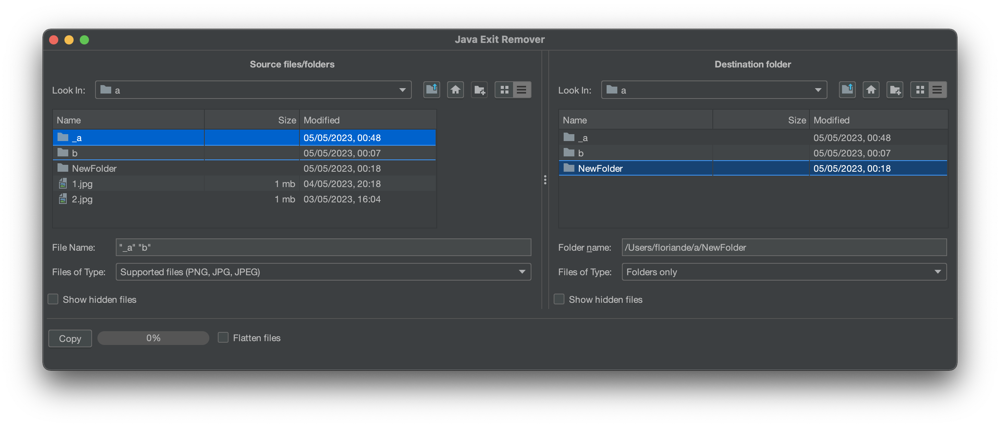
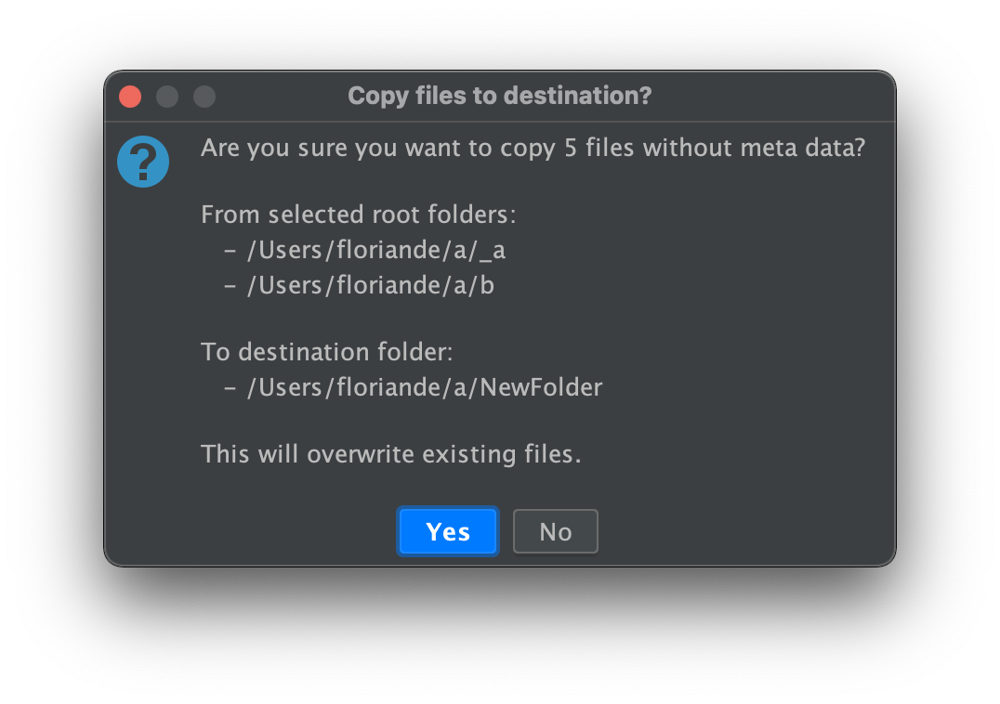

# java-exif-remover
A small java based program to delete EXIF metadata from images.

# Screenshots

## Special thanks to

* [Jannis Weis](https://github.com/weisJ) for putting so much effort and time into the development of [darklaf](https://github.com/weisJ/darklaf), a theme-based swing look and feel with many additional features that make it really pleasant to create some swing UIs again.